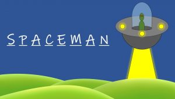

# Spaceman
###### Created by Damaris Fregoso

[Click To play](https://damarisfregoso.github.io/spaceman/)

## 🖨 Description 

A **space theme letter guessing game**! With space theme words to challenge the player. 

## 🕹 How to Win
 You are started off with **_6 guesses_**.  There are multipe words that will be randomly generated.  The goal is to find out the word before the number of guesses are completely out and spaceman is abucated piece by piece. 

 ## 📸 Screenshots  
  |   Description | Screenshot | 
  |:-------------:| -----------|
  |Start of the game | |
  |The player has won the game| |
  |The player guessed wrong and lost the game| |

## 💻 Technologies Used

## 📝 Getting Started

  
 Instructions 

    1. Press any letter to start the game.

    2. The game will let you know visually if the letter was correct or incorrect.

    3. If the letter is correct, before the entire spaceman body is gone that is considered a win.

    4. If the letters are incorrect, the spacemans body will disappear one by one 
    
    5. When the player has 0 guesses left and the spaceman is gone, a Play Again button will appear to reset the game. 

## 📡 Upcoming Features

- [❌] Display hints for each given word

- [❌] Have different themes the player can choose from

- [❌] When the game is won have a sound indicating that they have won 

